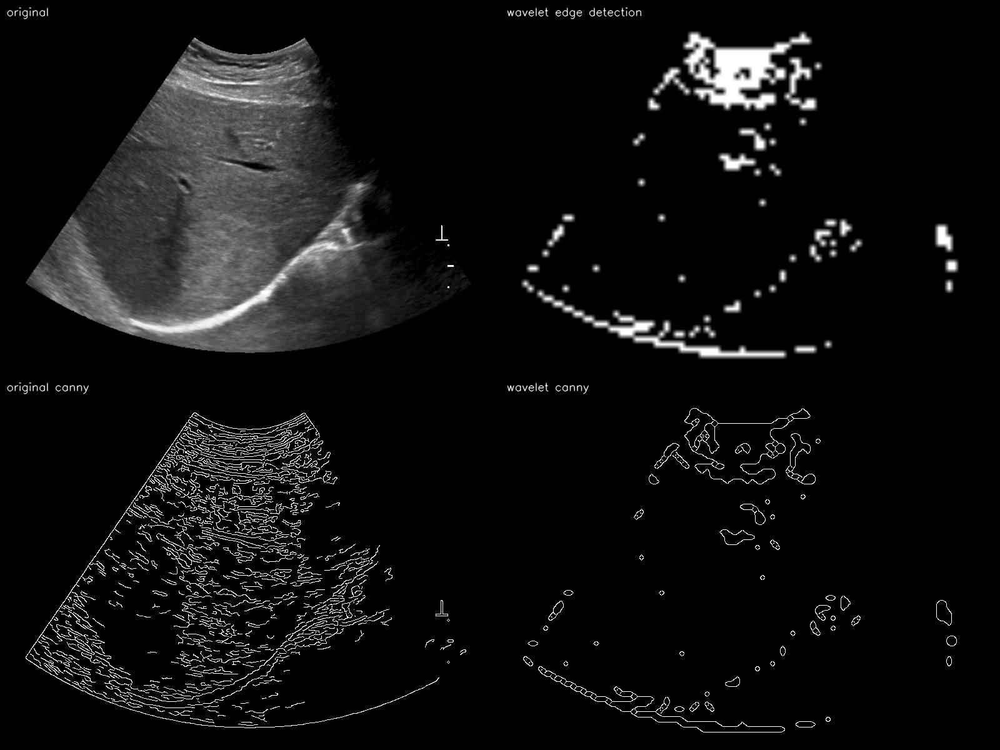
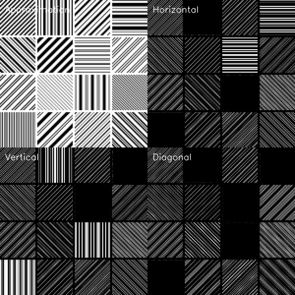
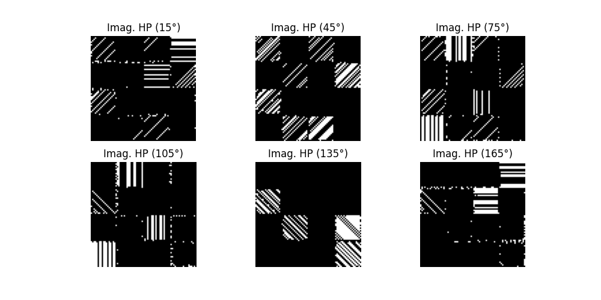
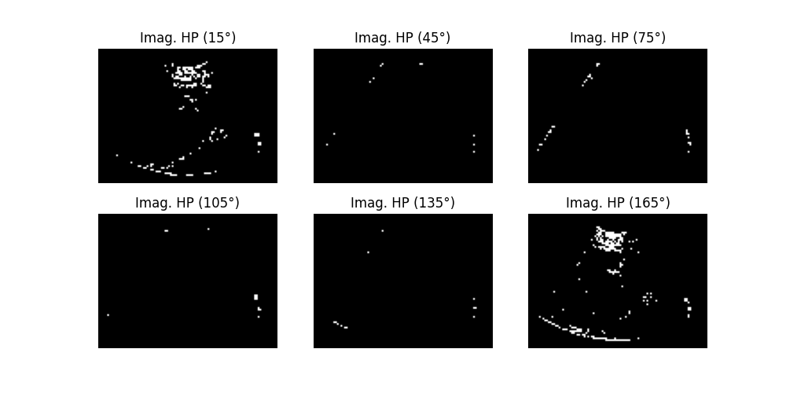

<h1>Edge Detection Using the Dual Tree Complex Wavelet Transform</h1>

    In this project, I followed the methodology that  <a href="https://www.sciencedirect.com/science/article/abs/pii/S0165168409003107">Kare et al. (2010) </a>used to extract the strong edges from an ultrasound image. I then compared it to the Canny edge detection algorithm applied to the raw image, which the DTCWT method appears to outperform by a significant margin.  

The dual-tree complex wavelet transform (DTCWT) has several advantages over the discrete wavelet transform (DWT) in that it possesses:

<ol>
    <li><b>Approximate shift invariance</b>. This preserves the phase information of the original image, which is important in the context of ultrasound imaging. </li>
    <li><b>Increased directional sensitivity</b> - there are 6 directional components roughly corresponding to: 15, 45, 75, 105, 135, and 165 degrees whereas the DWT only provides the horizontal, vertical and diagonal components.</li>
     
</ol>
A good example that demonstrates this directional sensitivity is shown below: 

 
Using the DWT:
 
Using the DTCWT:
 

Applied to the original ultrasound image:
